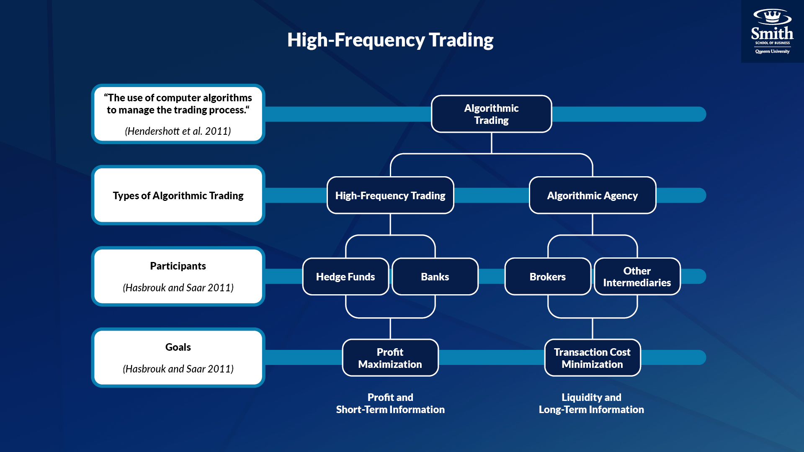

+++
# A Demo section created with the Blank widget.
# Any elements can be added in the body: https://sourcethemes.com/academic/docs/writing-markdown-latex/
# Add more sections by duplicating this file and customizing to your requirements.

widget = "blank"  # See https://sourcethemes.com/academic/docs/page-builder/
headless = true  # This file represents a page section.
active = true  # Activate this widget? true/false
weight = 15  # Order that this section will appear.

title = "Session 4"
subtitle = "Algorithmic Trading & High-Frequency Trading"

[design]
  # Choose how many columns the section has. Valid values: 1 or 2.
  columns = "1"

[design.background]
  # Apply a background color, gradient, or image.
  #   Uncomment (by removing `#`) an option to apply it.
  #   Choose a light or dark text color by setting `text_color_light`.
  #   Any HTML color name or Hex value is valid.

  # Background color.
  # color = "navy"
  
  # Background gradient.
  # gradient_start = "DarkGreen"
 # gradient_end = "ForestGreen"
  
  # Background image.
  # image = "image.jpg"  # Name of image in `static/media/`.
  # image_darken = 0.6  # Darken the image? Range 0-1 where 0 is transparent and 1 is opaque.
  # image_size = "cover"  #  Options are `cover` (default), `contain`, or `actual` size.
  # image_position = "center"  # Options include `left`, `center` (default), or `right`.
  # image_parallax = true  # Use a fun parallax-like fixed background effect? true/false
  
  # Text color (true=light or false=dark).
  text_color_light = false

[design.spacing]
  # Customize the section spacing. Order is top, right, bottom, left.
  padding = ["20px", "0", "20px", "0"]

[advanced]
 # Custom CSS. 
 css_style = ""
 
 # CSS class.
 css_class = ""
+++

At the end of this week, you will be able to: 
1. Describe the impact of high frequency trading in stock markets. 
1. Identify the differences between algorithmic trading and high frequency trading.  
1. Understand how execution benchmarks are constructed. 
  
<h2>Preview of Activities</h2>
<h3>Activity 4:  The Case of Knight Capital</h3>
In this activity, you will read a real case study of a high frequency trader and be asked to apply your learning about computerized trading to evaluate the moves that Knight Capital made and how the company could have better solved their problems.

<h3>Quiz</h3>
A link to the quiz will be provided by the instructor. This assessment will count towards your individual participation grade.

  
<h2>Algorithmic Trading</h2>

In algorithmic trading, the trading process is automated according to a set of pre-programmed rules and strategies that account for variables such as time, price, and volume. This enables investors to trade quickly, accurately and at reduced costs. 

The computerization of the order flow that began in the early 1970s paved the way for modern algorithmic trading practices. Algorithmic trading relies on computer programs with predefined criteria (often proprietary algorithms) to automatically execute trades. For example, algorithmic trading is often applied by institutional investors whose large orders would cause excessive price impact if executed entirely at once. To avoid price impact to the market, large order execution algorithms are used to slice the single large order into many smaller orders that are sent to the market over time (SEC, 2014, pg. 5).
 
Algorithmic trading encompasses a range of trading activities, one of which is high-frequency trading. Review the diagram below which depicts this relationship.

  
<h2>High-Frequency Trading</h2>

High-frequency traders use powerful computing technology to quickly process a high number of trades, often applying complex algorithms to trade across several markets simultaneously. In 2010, the SEC identified five characteristics that are frequently associated with high-frequency trading:
1. Use of extraordinarily high speed and sophisticated programs for generating, routing, and executing orders.
1. Use of co-location services and individual data feeds offered by exchanges and others to minimize network and other latencies.
1. Very short time-frames for establishing and liquidating positions.
1. Submission of numerous orders that are cancelled shortly after submission.
1. Ending the trading day in as close to a flat position as possible (that is, not carrying significant, unhedged positions overnight).” [(SEC, 2014, pg. 4)](https://www.sec.gov/marketstructure/research/hft_lit_review_march_2014.pdf)
 
High-frequency trading made notable headlines in 2010 when it was suspected to have been the driver of a “flash crash” that occurred on May 6, 2010; during the crash, a number of stock indices including the S&P 500 and the Dow Jones Industrial Average collapsed and rebounded within the span of 36 minutes. Within the 2010 Concept Release, the SEC acknowledged that HFT was one of the most significant market structure developments of the period, and that “[b]y any measure, HFT is a dominant component of the current market structure and likely to affect nearly all aspects of its performance.” [(SEC, 2010, pg. 3606)]((https://www.sec.gov/rules/concept/2010/34-61358fr.pdf))

**References**
U.S. Securities and Exchange Commission (SEC). (2010). Concept Release on Equity Market Structure; Proposed Rule. Federal Register / Vol. 75, No. 13. Retrieved on August 6, 2020 from [https://www.sec.gov/rules/concept/2010/34-61358fr.pdf](https://www.sec.gov/rules/concept/2010/34-61358fr.pdf) 
 
U.S. Securities and Exchange Commission (SEC). (2014). Equity Market Structure Literature - Review Part II: High Frequency Trading. Retrieved on August 6, 2020 from [https://www.sec.gov/marketstructure/research/hft_lit_review_march_2014.pdf](https://www.sec.gov/marketstructure/research/hft_lit_review_march_2014.pdf)

<h3>AT & HFT: Mandatory Readings</h3>

As you read through the articles below, consider how computerized trading has changed the trading landscape. 

1. <h4>Getting Up to Speed on High-Frequency Trading</h4> 
FINRA Staff. (2015, November 25). [Getting Up to Speed on High-Frequency Trading](https://www.finra.org/investors/insights/getting-speed-high-frequency-trading). Retrieved on July 30, 2020 from https://www.finra.org/investors/insights/getting-speed-high-frequency-trading
1. <h4>Equity Market Structure Literature Review Part II: High Frequency Trading</h4>
**Pages 4 - 11** of U.S. Securities and Exchange Commission. (2014, March 18). [Equity Market Structure Literature Review Part II: High Frequency Trading](https://www.sec.gov/marketstructure/research/hft_lit_review_march_2014.pdf). Retrieved on July 30, 2020 from https://www.sec.gov/marketstructure/research/hft_lit_review_march_2014.pdf
1. <h4>Tapping the Brakes: Are Less Active Markets Safer and Better for the Economy?</h4>
Stiglitz, J. (2014, April 15).  [Tapping the Brakes: Are Less Active Markets Safer and Better for the Economy?](https://www8.gsb.columbia.edu/faculty/jstiglitz/sites/jstiglitz/files/2014_Tapping_Brakes_pub.pdf) Retrieved on July 30, 2020 from https://www8.gsb.columbia.edu/faculty/jstiglitz/sites/jstiglitz/files/2014_Tapping_Brakes_pub.pdf

  

<h2>Execution Benchmarks</h2>

<h3>Execution Benchmarks: Mandatory Readings</h3>

Execution benchmarks are used to analyze trade performance and to make decisions about modifying algorithms. The following article presents how execution benchmarks are used to conduct a transaction-cost analysis (TCA).

1. <h4>Know Your Benchmark</h4> 
RCM Alternatives. (2018, June 28). [Know Your Benchmark](https://www.rcmalternatives.com/rcmx/2018/06/know-your-benchmark/). Retrieved August 07, 2020, from https://www.rcmalternatives.com/rcmx/2018/06/know-your-benchmark/

  

<h2>Deliverables</h2>
1. <h3>Weekly quiz. </h3>
The following quiz will count towards your participation score. Ensure you have completed the mandatory readings prior to beginning the quiz (as their content will be tested). You have until the beginning of next week's lecture to complete the quiz. 